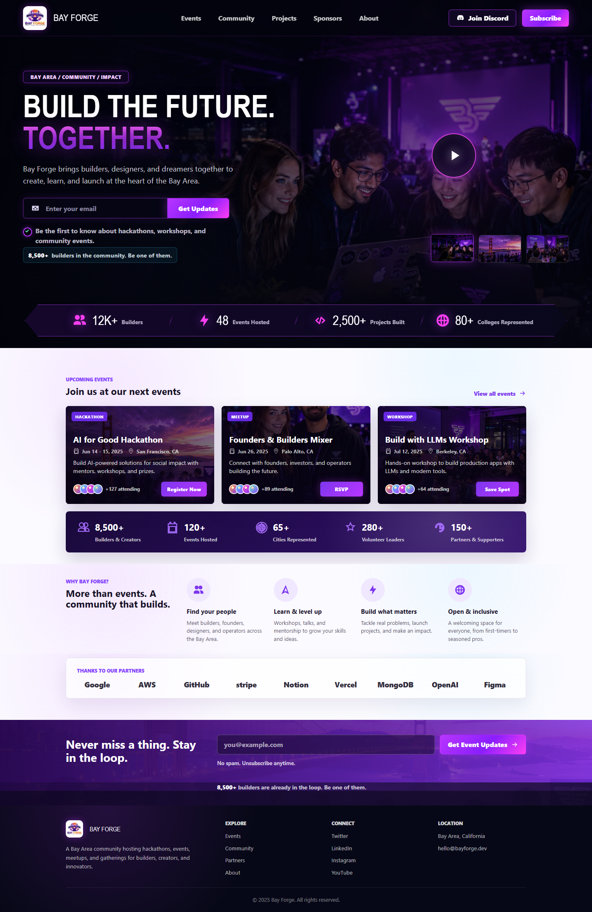
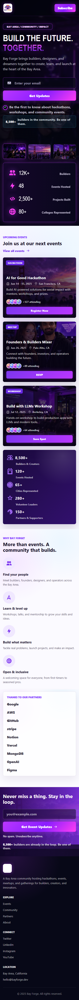
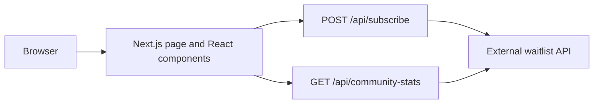

# Bay Forge

Bay Forge is a Next.js landing page for a Bay Area builder community, with event discovery, community storytelling, and a server-side waitlist signup proxy.

<p>
  <a href="#quick-start"></a>
  <a href="#stack"></a>
  <a href="#stack"></a>
  <a href="#verification"></a>
  <a href="#license"></a>
</p>

`Bay Area community` | `events` | `hackathons` | `waitlist proxy` | `responsive landing page`



## Contents

- [Overview](#overview)
- [Status](#status)
- [Screenshots](#screenshots)
- [Quick Start](#quick-start)
- [Configuration](#configuration)
- [Public Surface](#public-surface)
- [Architecture](#architecture)
- [Repository Map](#repository-map)
- [GitHub Account Rule](#github-account-rule)
- [Verification](#verification)
- [Contributing Notes](#contributing-notes)
- [License](#license)

## Overview

This repository contains the source for the Bay Forge landing site. The app presents a polished event and community page with:

- A full-bleed visual hero with rotating Bay Forge scenes.
- Email capture in both the hero and newsletter sections.
- A Next.js API proxy that forwards waitlist submissions to the configured upstream service without exposing the API key to the browser.
- A dynamic community count label that reads from `/api/community-stats` when the waitlist service is configured and falls back to the designed static count when it is not.
- Event cards, community metrics, partner logos, responsive mobile layout, and footer navigation.

## Status

| Area | Status | Repo evidence |
| --- | --- | --- |
| Next.js landing page | Implemented | `app/page.tsx`, `components/Hero.tsx`, `components/EventsSection.tsx` |
| Responsive styling | Implemented | `app/globals.css`, checked-in README screenshots |
| Waitlist signup proxy | Implemented | `app/api/subscribe/route.ts`, `lib/waitlist.ts` |
| Community stats proxy | Implemented | `app/api/community-stats/route.ts`, `components/CommunityCountProvider.tsx` |
| Runtime env sample | Source-complete | `.env.example` |
| Automated tests | Not configured | `package.json` has `dev`, `build`, and `start`, but no `test` script |
| CI workflow | Source-complete | `.github/workflows/datadog-synthetics.yml` runs Datadog Synthetic tests when Datadog secrets are configured |
| Production deployment config | Not checked in | No Vercel, Docker, or hosting config is present beyond standard Next.js settings |

## Screenshots

### Desktop


### Mobile



## Quick Start

Prerequisites:

- Node.js `20.9` or newer.
- npm, using the checked-in `package-lock.json`.
- A waitlist API key if you want live signup and community statistics.

PowerShell, macOS, and Linux:

```shell
npm install
cp .env.example .env.local
npm run dev
```

Open [http://localhost:3000](http://localhost:3000).

The copied `.env.local` keeps `WAITLIST_API_KEY` empty by default. Leave it empty for the local fallback count, or set a real key when you want live signup and community statistics.

Production build:

```powershell
npm run build
npm run start
```

## Configuration

Set these values in `.env.local` for local development or in the deployment environment for production.

| Variable | Default | Required | Effect |
| --- | --- | --- | --- |
| `WAITLIST_API_URL` | `https://emailwaitlist.ayushojha.com/api/v1/subscribe` | No | Upstream endpoint used by `POST /api/subscribe`. |
| `WAITLIST_STATS_URL` | Derived from `WAITLIST_API_URL` by replacing `/subscribe` with `/stats` | No | Upstream endpoint used by `GET /api/community-stats`. |
| `WAITLIST_API_KEY` | Empty | Yes for live waitlist behavior | Sent server-side as `X-API-Key`; never exposed to the browser by this app. Leave empty for the default local fallback mode. |

When `WAITLIST_API_KEY` is missing, signup requests return a server configuration error and community stats return `{ configured: false, total: null }`. The visible page keeps its designed fallback community count.

## Public Surface

### `POST /api/subscribe`

Accepts:

```json
{
  "email": "builder@example.com",
  "metadata": {
    "source": "landing-hero",
    "page": "/"
  }
}
```

Behavior:

- Validates email shape and length before contacting the upstream service.
- Requires `WAITLIST_API_KEY` on the server.
- Forwards metadata plus `source` and `submitted_via` defaults.
- Returns upstream success text and the latest community total when available.

### `GET /api/community-stats`

Returns configuration and count data for the frontend community label.

Example configured response:

```json
{
  "configured": true,
  "total": 8500,
  "today": 12,
  "this_week": 84,
  "this_month": 320
}
```

Example unconfigured response:

```json
{
  "configured": false,
  "total": null,
  "error": "WAITLIST_API_KEY is not set."
}
```

## Architecture



The browser only talks to local Next.js routes. The API key stays server-side inside the route handlers, and the upstream waitlist service is isolated behind the app proxy.

## Stack

| Layer | Choice |
| --- | --- |
| App framework | Next.js `^16.2.9` |
| UI runtime | React `^19.2.7`, React DOM `^19.2.7` |
| Language | TypeScript `^6.0.3` |
| Package manager | npm with `package-lock.json` |
| Images | `next/image` with checked-in assets under `public/assets/` |

## Repository Map

| Path | Purpose |
| --- | --- |
| `app/page.tsx` | Composes the landing page sections. |
| `app/layout.tsx` | Root metadata and global stylesheet wiring. |
| `app/globals.css` | Full visual system and responsive layout styling. |
| `app/api/subscribe/route.ts` | Server-side waitlist signup proxy. |
| `app/api/community-stats/route.ts` | Server-side community statistics proxy. |
| `components/` | Header, hero, events, partner, newsletter, footer, and signup UI. |
| `lib/waitlist.ts` | Waitlist URL, API key, email validation, and stats fetch helpers. |
| `public/assets/` | Logo and scene images used by the page. |
| `docs/assets/` | README screenshots. |
| `.github/workflows/datadog-synthetics.yml` | Datadog Synthetic test workflow; skips when Datadog secrets are not configured. |
| `.env.example` | Local environment template. |

## GitHub Account Rule

All GitHub operations for this repository must use the `ayushozha` account. This is a hard repository rule.

Before any push, pull request, issue, release, branch publication, or other mutating GitHub command, run:

```powershell
gh auth switch -u ayushozha
gh api user --jq .login
git remote -v
```

The active GitHub account must be:

```text
ayushozha
```

The remote owner must stay:

```text
git@github.com:ayushozha/BayForge.git
```

Do not push or create GitHub objects from the `ayushhijenny` or `ayushhijeny` account.

## Verification

Run before shipping changes:

```powershell
npm run build
```

Useful local smoke checks:

```powershell
npm run dev
```

Then verify:

- `/` renders the desktop and mobile layouts without broken images.
- `POST /api/subscribe` rejects invalid email addresses.
- `GET /api/community-stats` returns `configured: false` when `WAITLIST_API_KEY` is missing.
- Signup succeeds only when the upstream waitlist service and API key are configured.

Current validation caveat: this repo does not currently define a `test` or `lint` script in `package.json`.

## Contributing Notes

- Keep `WAITLIST_API_KEY` server-side. Do not expose it through client components, public env vars, or static assets.
- Keep signup behavior routed through `app/api/subscribe/route.ts` so validation, metadata defaults, and error handling stay centralized.
- Keep README screenshots under `docs/assets/` so GitHub renders them from tracked files.
- Preserve the `ayushozha` GitHub account invariant before any remote mutation.
- Avoid documenting roadmap items as shipped functionality; update the status table when behavior changes.

## License

No license file is currently checked in. Until a license is added, reuse, distribution, and modification rights are not granted by this repository.
